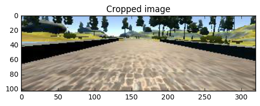

# Behavioral Cloning

##Overview
This project aims to develop and train a deep learning network that learns how to drive a car around a track. The training data was provided by the Udacity team, since the data was limited an image generator was implemented to generate more data. When the model was ready I tested it running the simulator in autonomus mode, the car succesfully drove around the track.

The main parts of the code:

1. *Preprocessing trainig data.*
3. *Normalization of data.*
4. *Augmentation methods.*
5. *Data generator.*
5. *Define NVIDIA model.*
6. *Adaptative throttle.*

I'd like to thank this paper from [NVIDIA paper](http://images.nvidia.com/content/tegra/automotive/images/2016/solutions/pdf/end-to-end-dl-using-px.pdf) and [this post](https://chatbotslife.com/using-augmentation-to-mimic-human-driving-496b569760a9#.d779iwp28) for the great help they provide.

#Preprocessing data training
The training data originally had a size of 160x320x3, since each image has information that is not relevant for driving, like the sky or the trees. I cropped the top 1/5 of the image and in the bottom I cropped 25 pixels to remove the hood of the car and converted to RGB.

The following image is an example of the results.

Original Image

After removing sky and hood

Finally the image was resized to fit the NVIDIA model, the size should be 66x200x3.

## Normalization of data ##

I used the [Lambda](https://keras.io/layers/core/) keras layer to normalize.

#Augmentation methods##
##Flip images
In the track there are more turns to the left than to the right, so in order to avoid a learning biased to turning left. I flipped the images half of the time and since the image is now reverse the angle should be changed to the other direction. This can be achieve by multiplying by -1 the original angle.

##Recovery with left and right images
The dataset provided contained the left and right views corresponding to each center image. Using these images and adding a constant, in this case 0.25,  we can teach the model how to recover when going off the road. This constant is added to left views since the car should move to the right to get to the center and for the right view is substracted since the car should move to the left to get to the center.

##Noise in the steering angle
I added some random noise to the steering angle in the training data, this with the purpose of aumenting the number of right responses to each image. The noise is in the range of 0 to 4% . 

#Model Architecture

I followed the architecture proposed by [NVIDIA paper](http://images.nvidia.com/content/tegra/automotive/images/2016/solutions/pdf/end-to-end-dl-using-px.pdf).

In order to implement exactly the model proposed on the paper I did not introduce any Dropout or Maxpooling layer. Furthermore the model is quite simple that it does not need this techniques to avoid overfittig, instead the generation or more data to train the model is the approach taken to prevent overfitting.

0. Input image of size 66x200x3
1. **Layer 1** : Lambda layer with a lambda function to normalize data 
2. **Layer 2** : Convolutional layer using 24 of size 5x5 filters followed by ELU activation
3. **Layer 3** : Convolutional layer using 36 of size 5x5 filters followed by ELU activation
4. **Layer 4** : Convolutional layer using 48 of size 5x5 filters followed by ELU activation
5. **Layer 5** : Convolutional layer using 64 of size 3x3 filters followed by ELU activation
6. **Layer 6** : Convolutional layer using 64 of size 3x3 filters followed by ELU activation
7. **Layer 7** : Convolutional layer using 64 of size 3x3 filters followed by ELU activation
8. **Layer 8** : Flatten layer
9. **Layer 9**: Fully connected layer with 1164 neurons
10. **Layer 10** : Fully connected layer with 100 neurons
11. **Layer 11** : Fully connected layer with 50 neurons
12. **Output** : Angle predicted

#Training - Data generator
It is desirable to have as much data as possible to train the model but as we can imagine we cannot create a lot data, store it and then read it all at once. So an image generator was implemented to produce more data on the fly, later give a batch of this data to the model and then take a new batch of new data. 

'Fit_generator' from keras was used to train the model using a python generator that passes data in batches of 256 images trained for 10 epochs at each epoch 20,224 new images were created using the augmentation describe above. The output of the generator is an image and its correponding angle.

I used an Adam optimizer with learning rate of 0.0001 

#Solution to problems encountered

##Turns
At the some point my car was driving around the track without problems but in some sharp turns did't turn enough to pass the curve. First I tried to add more images of those spots to the training data but it didn't help much. In order to make the response of the car more aggresive when it encounter turns, I increase the steering angle of the training data by 20%. 

##Adaptative throttle.
When the simulator was running at same time wiht other programs opened in my computer, the model failed at some sharp turns, this may be due to hardware limitations. For that reason I implemented a function that uses the steering to determining the speed. So the larger the steering angle the lower the speed.

##Video

You can watch the video of my car driving around the track [here](https://youtu.be/qul0ABQCy4E).

